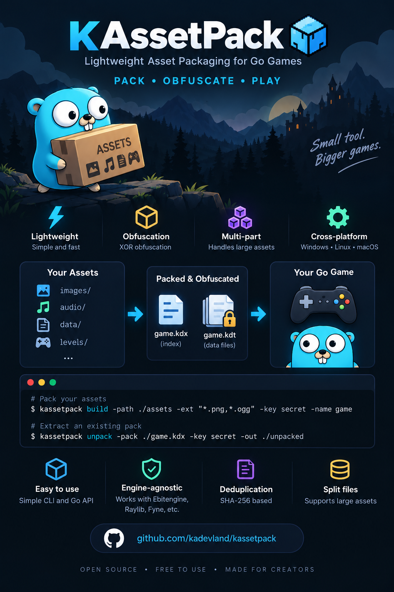

# KAssetPack

**Lightweight asset packaging for Go applications and games.**

<p align="center">
  
</p>

KAssetPack packages your assets into a compact index and one or more data files, with optional XOR obfuscation and automatic deduplication.

Instead of distributing an exposed asset directory:

```text
game/
├── game.exe
├── assets/
│   ├── images/
│   ├── audio/
│   ├── fonts/
│   └── ...
```

you can distribute:

```text
game/
├── game.exe
├── game.kdx
├── game.kdt
└── game_01.kdt
```

At runtime, assets are accessed through their logical keys:

```go
data, err := bank.Read("images/player.png")
```

or streamed directly:

```go
reader, err := bank.Open("audio/music.ogg")
```

KAssetPack is intentionally small and focused. It is designed for applications that need a simple way to package their assets without introducing a large asset management system. It is completely engine-agnostic and works perfectly with top Go frameworks like **Ebitengine**, **Raylib**, or UI toolkits like **Fyne**.

> **Important:** XOR provides obfuscation, not cryptographic security. It is intended to make direct access to packaged assets less trivial, not to protect sensitive data.

---

## Features

* Package multiple assets into a single pack
* Logical asset paths independent from physical file paths
* Optional XOR obfuscation
* Automatic SHA-256 based deduplication
* Automatic data file splitting
* Multiple data files supported
* Lazy access to data files
* Read an entire asset into memory
* Stream assets through `io.ReadCloser`
* Small API
* No complex runtime asset system
* 100% engine-agnostic (works with Ebitengine, Raylib, Fyne, etc.)

---

# Installation

Install KAssetPack with Go:

```bash
go get github.com/kadevland/kassetpack
```

Then import it:

```go
import "github.com/kadevland/kassetpack"
```

---

# Quick Start

The typical workflow has two phases:

```text
Build time
    │
    ├── Add assets
    ├── Deduplicate
    ├── Obfuscate
    ├── Split data files
    └── Save the pack
             │
             ▼
        .kdx + .kdt files

Runtime
    │
    ├── Load the index
    ├── Locate the asset
    └── Read or stream the data
```

---

## 1. Create a pack

Create an `AssetBuilder` and add your files:

```go
builder := kassetpack.NewAssetBuilder()

builder.AppendAsset(
    "./assets/images/player.png",
    "images/player.png",
)

builder.AppendAsset(
    "./assets/audio/music.ogg",
    "audio/music.ogg",
)

err := builder.Save(".", "game")
if err != nil {
    return err
}
```

This produces:

```text
game.kdx
game.kdt
```

The first argument of `AppendAsset` is the **physical file path**.

The second argument is the **logical key** used by the application at runtime.

---

## 2. Load the pack

At runtime:

```go
bank := &kassetpack.AssetBank{}

err := bank.Load(".", "game", nil)
if err != nil {
    return err
}

defer bank.Close()
```

The `AssetBank` loads the index and uses it to locate assets inside the data files.

---

## 3. Read an asset

Use `Read` when you want the complete asset in memory:

```go
data, err := bank.Read("images/player.png")
if err != nil {
    return err
}
```

For example, with an image decoder:

```go
data, err := bank.Read("images/player.png")
if err != nil {
    return err
}

// Use data to decode the image.
```

`Read` returns the original, deobfuscated asset data.

---

# CLI Tool

KAssetPack includes a command-line tool for building and extracting asset packs without writing any Go code.

## 1. Build the CLI

You can build the CLI locally using the provided `Makefile`:

```bash
# Build for your current platform
make build

# Build release binaries for all supported platforms
make release VERSION=v0.2.0
```

The executable is generated in the `build/` directory.

On Linux and macOS:

```text
build/
└── kassetpack
```

On Windows:

```text
build/
└── kassetpack.exe
```

---

## 2. Build an Asset Pack

Use the `build` command to package a directory into `.kdx` and `.kdt` files.

### Pack all files

```bash
./build/kassetpack build \
    -path ./assets \
    -out ./game_data \
    -name core
```

### Pack specific file types

```bash
./build/kassetpack build \
    -path ./assets \
    -ext "*.png,*.ogg" \
    -base "game" \
    -key "MySecretKey" \
    -name core
```

This can produce:

```text
game_data/
├── core.kdx
├── core.kdt
└── core_01.kdt
```

### Build Flags

| Flag | Description | Default |
|---|---|---|
| `-path` | Source directory to package | `./assets` |
| `-ext` | Comma-separated extensions such as `"*.png,*.ogg"` | All files |
| `-base` | Logical path prefix | Empty |
| `-name` | Base name of the generated pack | `game` |
| `-key` | Optional XOR obfuscation key | None |
| `-size` | Maximum `.kdt` file size in MB | `600` |
| `-out` | Output directory | `./build` |

For example, using:

```bash
-base "game"
```

maps:

```text
./assets/images/player.png
```

to the logical asset key:

```text
game/images/player.png
```

> **Note:** The XOR key provides obfuscation, not encryption. Do not use it to protect sensitive information.

---

## 3. Unpack an Asset Pack

The `unpack` command extracts the contents of an existing asset pack. This can be useful for debugging, testing, or inspecting generated packs.

```bash
./build/kassetpack unpack \
    -pack ./game_data/core.kdx \
    -key "MySecretKey" \
    -out ./unpacked
```

### Unpack Flags

| Flag | Description | Default |
|---|---|---|
| `-pack` | Path to the `.kdx` index file | Required |
| `-key` | XOR key used when the pack was built | None |
| `-out` | Extraction directory | `./unpacked` |

---

## 4. Global Flags

Display the CLI help:

```bash
kassetpack -help
```

Display the current version:

```bash
kassetpack -version
```

---

# Logical Paths and Aliases

Physical files and runtime asset keys do not have to be the same.

For example:

```go
builder.AppendAsset(
    "./assets/images/player.png",
    "sprites/player.png",
)
```

The physical file is:

```text
./assets/images/player.png
```

but the application accesses it using:

```go
bank.Read("sprites/player.png")
```

This means the physical directory structure does not need to be exposed to the runtime.

---

## Without an Alias

The alias is optional.

You can simply write:

```go
builder.AppendAsset("./assets/background.png")
```

When no logical key is provided, the physical path becomes the logical key in the index.

The asset can then be read using:

```go
data, err := bank.Read("./assets/background.png")
```

This is useful when you do not need to change the asset's runtime name.

---

# XOR Obfuscation

KAssetPack optionally supports XOR obfuscation.

Set a key on the builder:

```go
key := []byte("my-secret-key")

builder := kassetpack.NewAssetBuilder()
builder.SetXORKey(key)
```

The generated data is then stored obfuscated.

The same key must be supplied when loading the pack:

```go
bank := &kassetpack.AssetBank{}

err := bank.Load(".", "game", key)
if err != nil {
    return err
}
```

The application receives the original data when using `Read` or `Open`.

---

## What XOR does — and does not do

XOR is deliberately used here as **obfuscation**.

It can help prevent a user from simply opening:

```text
game.kdt
```

and immediately seeing the original asset bytes.

It does **not** provide strong security.

A determined user can reverse engineer the application and recover the key or reproduce the decoding process.

Therefore, KAssetPack should **not** be used to protect:

* passwords
* private keys
* authentication credentials
* confidential information
* cryptographic secrets

Its purpose is simply to make packaged assets less directly accessible.

---

# Deduplication

KAssetPack automatically detects duplicate asset data.

For example:

```go
builder.AppendAsset(
    "./assets/shared.png",
    "menu/background.png",
)

builder.AppendAsset(
    "./assets/shared.png",
    "game/background.png",
)
```

Both logical entries can point to the same physical data.

The index contains two logical entries:

```text
menu/background.png
game/background.png
```

but the actual asset data is stored only once.

Conceptually:

```text
Index
────────────────────────────────────
menu/background.png ──┐
                      ├──> offset 0
game/background.png ──┘

Data
────────────────────────────────────
[ shared asset data ]
```

Deduplication is based on the asset content rather than its logical name.

This means that different physical files containing identical data can also be detected as duplicates.

---

# Data File Splitting

Large packs can be split across multiple data files.

Configure the maximum data file size:

```go
builder.SetMaxDataSize(600)
```

The value is expressed in megabytes.

For example, a pack may produce:

```text
game.kdx
game.kdt
game_01.kdt
game_02.kdt
```

The index stores which data file contains each asset.

Conceptually:

```text
game.kdx
   │
   ├── asset A → FileID 0 → game.kdt
   ├── asset B → FileID 0 → game.kdt
   ├── asset C → FileID 1 → game_01.kdt
   └── asset D → FileID 2 → game_02.kdt
```

The application does not need to know which physical data file contains an asset.

It simply requests:

```go
data, err := bank.Read("images/background.png")
```

KAssetPack resolves the correct data file automatically.

---

# Streaming Assets

`Read` loads the complete asset into memory.

For larger assets, use `Open`:

```go
reader, err := bank.Open("audio/music.ogg")
if err != nil {
    return err
}

defer reader.Close()
```

`Open` returns an `io.ReadCloser`.

This allows the application to consume the asset as a stream rather than first loading the complete asset into a byte slice.

For example:

```go
reader, err := bank.Open("audio/music.ogg")
if err != nil {
    return err
}

defer reader.Close()

buffer := make([]byte, 32*1024)

for {
    n, err := reader.Read(buffer)

    if n > 0 {
        // Process the data.
    }

    if err == io.EOF {
        break
    }

    if err != nil {
        return err
    }
}
```

When XOR obfuscation is enabled, deobfuscation is performed while reading.

The complete deobfuscated asset does not need to be created in memory first.

---

# Builder

The builder is used when creating a pack.

```go
builder := kassetpack.NewAssetBuilder()
```

## `SetXORKey`

```go
builder.SetXORKey(key)
```

Sets the XOR obfuscation key used when generating the pack.

The same key must be supplied to `AssetBank.Load`.

---

## `SetMaxDataSize`

```go
builder.SetMaxDataSize(600)
```

Sets the maximum size of generated data files in megabytes.

When the limit is reached, KAssetPack creates another data file.

---

## `AppendAsset`

Without an alias:

```go
builder.AppendAsset("./assets/image.png")
```

With a logical key:

```go
builder.AppendAsset(
    "./assets/image.png",
    "images/image.png",
)
```

The first parameter identifies the physical file.

The optional second parameter defines the logical key stored in the index.

---

## `AddFolder`

`AddFolder` recursively scans a directory and adds files matching the requested extensions.

```go
err := builder.AddFolder(
    "./assets",
    []string{"png", "jpg", "ogg"},
    "game",
)
```

The first argument is the physical directory to scan.

The second argument contains the extensions to include. An empty list includes all files:

```go
err := builder.AddFolder(
    "./assets",
    []string{},
    "game",
)
```

The third argument defines the logical base path stored in the index.

For example:

```text
./assets/images/player.png
```

with the logical base path `game` becomes:

```text
game/images/player.png
```

Directory scanning is recursive, so files inside subdirectories are included automatically.

---

## `Save`

```go
err := builder.Save(".", "game")
```

Processes the added assets and generates the index and data files.

For the example above:

```text
game.kdx
game.kdt
```

If splitting is required:

```text
game.kdx
game.kdt
game_01.kdt
game_02.kdt
```

---

## `ClearFiles`

```go
builder.ClearFiles()
```

Resets the list of files queued for packaging.

The builder configuration, such as the XOR key and maximum data size, is preserved.

This allows the same builder instance to be reused with the same configuration.

---

# AssetBank

`AssetBank` is the runtime side of KAssetPack.

```go
bank := &kassetpack.AssetBank{}
```

It loads the generated index and provides access to the packaged assets.

---

## `Load`

```go
err := bank.Load(".", "game", key)
```

Loads a generated pack.

The arguments identify:

1. the directory containing the pack
2. the pack base name
3. the XOR key, if obfuscation was used

For a pack named:

```text
game.kdx
game.kdt
game_01.kdt
```

the base name is:

```text
game
```

---

## `Read`

```go
data, err := bank.Read("images/player.png")
```

Reads the complete asset and returns its original data.

Use this when the asset is reasonably small or when the consuming API already expects a byte slice.

---

## `Open`

```go
reader, err := bank.Open("audio/music.ogg")
```

Opens an asset as a stream.

The returned reader implements:

```go
io.ReadCloser
```

This is useful for large assets or APIs that can consume an `io.Reader`.

---

## `Close`

```go
bank.Close()
```

Closes resources associated with the asset bank.

A typical usage is:

```go
bank := &kassetpack.AssetBank{}

if err := bank.Load(".", "game", key); err != nil {
    return err
}

defer bank.Close()
```

---

# Generated Files

KAssetPack uses two types of files.

## Index file

The index uses the `.kdx` extension.

Example:

```text
game.kdx
```

The index contains the information required to locate each logical asset.

An entry conceptually contains:

```text
Path
FileID
Offset
Size
Checksum
```

### Path

The logical key used to access the asset.

Example:

```text
images/player.png
```

### FileID

Identifies which data file contains the asset.

### Offset

The byte offset where the asset starts in the data file.

### Size

The number of bytes belonging to the asset.

### Checksum

The SHA-256 checksum used during the build process to identify duplicate asset data.

---

# Data Files

Packaged asset data is stored in `.kdt` files.

The first data file uses the base name:

```text
game.kdt
```

Additional files use numbered suffixes:

```text
game_01.kdt
game_02.kdt
game_03.kdt
```

The index tells the runtime which file and byte range contain each asset.

---

# Runtime Architecture

KAssetPack intentionally keeps the runtime model simple:

```text
                 AssetBank
                    │
                    ▼
                  .kdx
                    │
          ┌─────────┼─────────┐
          ▼         ▼         ▼
       FileID 0  FileID 1  FileID 2
          │         │         │
          ▼         ▼         ▼
      game.kdt  game_01.kdt game_02.kdt
```

The index is loaded so assets can be located quickly.

Data files are accessed when an asset is actually requested.

This means the complete contents of every `.kdt` file do not need to be loaded into memory just to use the pack.

---

# Example: Complete Builder

A simple build program can look like this:

```go
package main

import (
    "log"

    "github.com/kadevland/kassetpack"
)

func main() {
    builder := kassetpack.NewAssetBuilder()

    builder.SetXORKey([]byte("my-secret-key"))
    builder.SetMaxDataSize(600)

    builder.AppendAsset(
        "./assets/images/player.png",
        "images/player.png",
    )

    builder.AppendAsset(
        "./assets/images/background.png",
        "images/background.png",
    )

    builder.AppendAsset(
        "./assets/audio/music.ogg",
        "audio/music.ogg",
    )

    if err := builder.Save("./build", "game"); err != nil {
        log.Fatal(err)
    }
}
```

Output:

```text
build/
├── game.kdx
├── game.kdt
└── ...
```

---

# Example: Complete Runtime

```go
package main

import (
    "log"

    "github.com/kadevland/kassetpack"
)

func main() {
    key := []byte("my-secret-key")

    bank := &kassetpack.AssetBank{}

    if err := bank.Load("./build", "game", key); err != nil {
        log.Fatal(err)
    }

    defer bank.Close()

    data, err := bank.Read("images/player.png")
    if err != nil {
        log.Fatal(err)
    }

    _ = data
}
```

---

# Example with Image Decoding

KAssetPack does not try to replace your framework's resource APIs.

It simply provides the packaged bytes.

For example:

```go
data, err := bank.Read("images/player.png")
if err != nil {
    return err
}
```

The returned data can then be passed to the appropriate Go decoder (like `image.Decode`).

This keeps KAssetPack independent from the rendering layer.

The same pack can therefore be used by different Go applications.

---

# Recommended Project Layout

A project using KAssetPack might look like:

```text
my-game/
├── assets/
│   ├── images/
│   ├── audio/
│   ├── fonts/
│   └── ...
│
├── cmd/
│   └── kassetpack/
│
├── Makefile
│
├── game/
│
└── build/
    ├── game.kdx
    ├── game.kdt
    └── game_01.kdt
```

The source `assets/` directory is used during the build process.

The packaged files are then distributed with the game.

---

# Choosing Between `Read` and `Open`

Use `Read` when:

```text
The asset is small
        │
        ▼
You need []byte
        │
        ▼
Read()
```

Example:

```go
data, err := bank.Read("images/player.png")
```

Use `Open` when:

```text
The asset is large
        │
        ▼
The consumer supports io.Reader
        │
        ▼
Open()
```

Example:

```go
reader, err := bank.Open("audio/music.ogg")
```

The important difference is that `Read` gives you the complete asset as a byte slice, while `Open` provides streaming access.

---

# When Should You Use KAssetPack?

KAssetPack is useful when you want a simple asset distribution format for a Go application or game.

Typical use cases include:

* Ebitengine games
* Raylib games
* Fyne applications
* 2D games
* Small game engines
* Game tools
* Applications with bundled binary resources
* Projects where exposing the complete asset directory is undesirable

It is particularly useful when the runtime only needs a simple interface such as:

```go
bank.Read("images/player.png")
```

or:

```go
bank.Open("audio/music.ogg")
```

---

# What KAssetPack Is Not

KAssetPack is intentionally not:

* a complete resource manager
* a virtual filesystem
* an encryption system
* a compression framework
* a dependency injection system
* a game engine
* a specific framework's asset API

Its job is much simpler:

```text
Files
  ↓
Package
  ↓
Index + Data
  ↓
Read / Stream
```

---

# Limitations

## XOR is not encryption

The XOR mechanism is designed for obfuscation only.

It should not be considered a security boundary.

---

## Assets are still extractable

Because the game itself needs to read the assets, a sufficiently determined user can reverse engineer the application and extract them.

KAssetPack does not attempt to prevent this.

---

## `Read` uses memory

`Read` returns the complete asset as a byte slice.

For large assets, prefer `Open` when the consuming API supports streaming.

---

# Testing

KAssetPack uses Go's standard `testing` package.

The test suite covers important packaging behaviors including:

* assets without aliases
* logical aliases
* building and reading packs
* missing assets
* deduplication
* data file splitting
* multiple data files
* large-scale deduplication
* recursive folder scanning
* extension filtering
* CLI build and unpack workflows

Example:

```go
func TestBuildAndRead(t *testing.T) {
    // ...
}
```

The tests intentionally verify the generated files and the data returned by the runtime API.

For example, deduplication is verified by checking that multiple logical entries point to the same physical data range while still remaining independently addressable.

---

# Design Goals

KAssetPack follows a few simple principles.

### Small

The library should remain easy to understand.

### Predictable

The relationship between an asset key, its index entry and its data location should be straightforward.

### Streaming-friendly

Assets should not need to be fully loaded into memory when the consumer only needs a stream.

### Engine-independent

KAssetPack should work with Go applications in general and should not require any specific engine.

### Easy to integrate

The runtime API should be small enough to disappear into the rest of the application.

---

# API Overview

## Builder

```go
NewAssetBuilder()

SetXORKey(key []byte)

SetMaxDataSize(sizeInMB int64)

AppendAsset(filePath string)

AppendAsset(filePath string, logicalKey string)

AddFolder(folderPath string, extensions []string, rebasePath string) error

Save(destPath string, baseName string) error

ClearFiles()
```

## Runtime

```go
AssetBank{}

Load(path string, baseName string, key []byte) error

Read(key string) ([]byte, error)

Open(key string) (io.ReadCloser, error)

Close()
```

---

# Complete Workflow

A typical project workflow looks like this:

```text
                 SOURCE ASSETS
                      │
                      ▼
              ┌───────────────┐
              │ AssetBuilder  │
              └───────┬───────┘
                      │
          ┌───────────┼───────────┐
          │           │           │
          ▼           ▼           ▼
      Deduplicate  XOR         Split
          │           │           │
          └───────────┼───────────┘
                      ▼
                ┌───────────┐
                │   .kdx    │
                │   .kdt    │
                │ .kdt ...  │
                └─────┬─────┘
                      │
                  DISTRIBUTE
                      │
                      ▼
                ┌───────────┐
                │ AssetBank │
                └─────┬─────┘
                      │
              ┌───────┴───────┐
              ▼               ▼
            Read             Open
              │               │
              ▼               ▼
           []byte          io.Reader
```

The entire system is built around this simple separation:

**Builder for packaging, AssetBank for runtime access.**

---

# Advanced Usage: Dev vs Prod with Go Build Tags

KAssetPack can be combined with Go's build constraints (`//go:build`) to use different asset backends for Development and Production builds.

This makes it possible to have:

* **Development:** assets loaded directly from the filesystem for fast iteration and hot reload.
* **Production:** assets loaded from a KAssetPack package.
* **Application code:** a single interface and factory, with no development/production conditionals.

The compiler selects the appropriate implementation at build time.

## 1. Define the Interface

Your application only needs to know about the operations it requires:

```go
package main

import "io"

// AssetBankInterface defines the contract for reading game assets.
type AssetBankInterface interface {
    Load(basePath string, baseName string, xorKey []byte) error
    Read(path string) ([]byte, error)
    Open(path string) (io.ReadCloser, error)
    Close() error
}
```

The application can then use an `AssetBankInterface` without knowing which implementation is being used.

---

## 2. Development Implementation

Create a `bank_dev.go` file:

```go
//go:build dev

package main

import (
    "io"
    "os"
    "path/filepath"
)

// devBank reads assets directly from the filesystem.
type devBank struct {
    BasePath string
}

func (b *devBank) Load(basePath string, baseName string, xorKey []byte) error {
    b.BasePath = basePath
    return nil
}

func (b *devBank) Read(path string) ([]byte, error) {
    return os.ReadFile(filepath.Join(b.BasePath, path))
}

func (b *devBank) Open(path string) (io.ReadCloser, error) {
    return os.Open(filepath.Join(b.BasePath, path))
}

func (b *devBank) Close() error {
    return nil
}

// NewAssetBank creates the development asset bank.
func NewAssetBank() AssetBankInterface {
    return &devBank{}
}
```

This implementation completely bypasses KAssetPack and reads assets directly from the filesystem.

That makes development convenient because modifying an asset does not require rebuilding the asset package.

For example:

```text
assets/
├── images/
│   ├── player.png
│   └── background.png
└── audio/
    └── music.ogg
```

The development build can read these files directly.

---

## 3. Production Implementation

Create a `bank_prod.go` file:

```go
//go:build !dev

package main

import "github.com/kadevland/kassetpack"

// NewAssetBank creates the production asset bank.
func NewAssetBank() AssetBankInterface {
    return &kassetpack.AssetBank{}
}
```

No wrapper is required because `kassetpack.AssetBank` already implements `AssetBankInterface`.

The production implementation therefore remains extremely small.

---

## 4. Application Code

Your application does not need to know which implementation is being used.

```go
package main

import (
    "log"
)

func main() {
    bank := NewAssetBank()

    if err := bank.Load("game", "core", []byte("SecretKey")); err != nil {
        log.Fatal(err)
    }

    defer bank.Close()

    data, err := bank.Read("images/player.png")
    if err != nil {
        log.Fatal(err)
    }

    // ...
    _ = data
}
```

There are no `if dev` or `if production` checks in the application code.

The selected implementation is determined by the Go build constraints.

---

## 5. Run in Development Mode

Use the `dev` build tag:

```bash
go run -tags dev .
```

The compiler includes:

```text
bank_dev.go
```

and excludes:

```text
bank_prod.go
```

The application therefore reads assets directly from the filesystem.

---

## 6. Build for Production

Build normally:

```bash
go build .
```

Without the `dev` tag, Go includes:

```text
bank_prod.go
```

and excludes:

```text
bank_dev.go
```

The resulting binary therefore uses `kassetpack.AssetBank`.

The development filesystem implementation is not compiled into the production binary.

---

## Why This Is Useful

This approach keeps the development workflow convenient without adding development-specific logic to the application itself.

```text
                    Application
                         │
                         ▼
                AssetBankInterface
                         │
                  NewAssetBank()
                         │
             ┌───────────┴───────────┐
             │                       │
        -tags dev               production
             │                       │
             ▼                       ▼
         devBank               AssetBank
             │                       │
             ▼                       ▼
       OS filesystem          KAssetPack
```

Development:

```text
Game
 │
 └── assets/
      ├── images/
      ├── audio/
      └── ...
```

Production:

```text
Game
 │
 ├── game.kdx
 ├── game.kdt
 └── game_01.kdt
```

The application uses the same API in both cases.

### Important

This build-tag approach is **not a security mechanism**.

It ensures that the development filesystem implementation is excluded from the production build, but it does not prevent users from reverse engineering the game or extracting assets.

Likewise, KAssetPack's XOR feature provides **obfuscation, not encryption**.

Its purpose is to avoid distributing the assets as a directly accessible filesystem tree and to make casual inspection less straightforward.

---

# License

See the `LICENSE` file included in this repository.